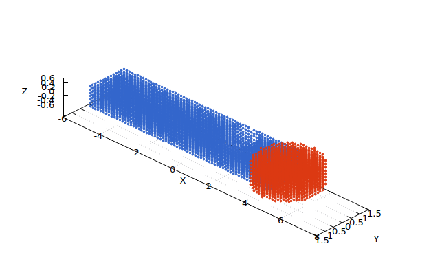
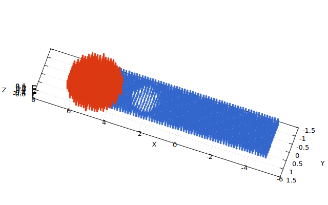
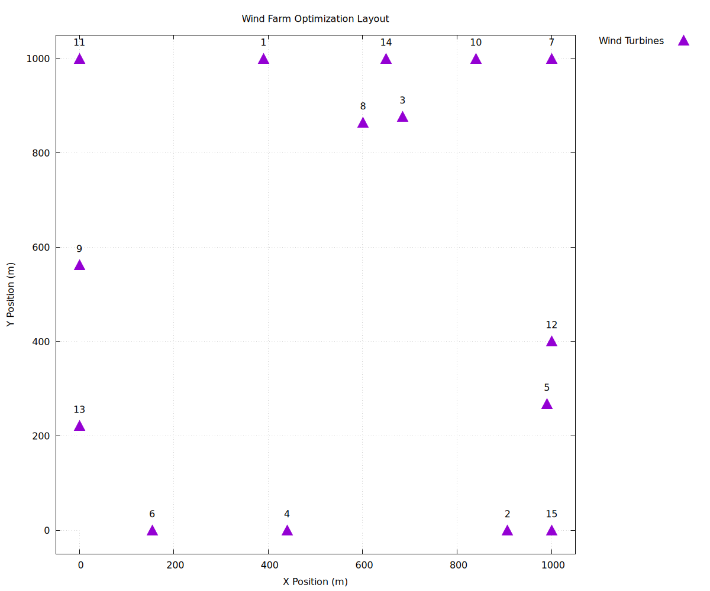
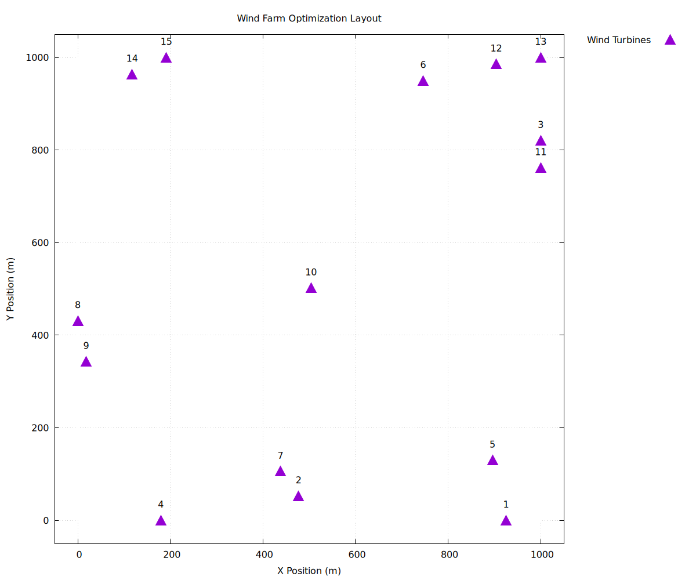

# Montecarlo Integration
This project implements a Monte Carlo integration algorithm in C++ to calculate definite integrals over N-dimensional hyperspheres and hyperrectangles. The software can use the **muParserX** library to parse mathematical functions at runtime.

## 📚 Documentation

Full API documentation is available via Doxygen:

```bash
# Generate documentation (requires doxygen and graphviz)
doxygen Doxyfile

# Open in browser
open docs/html/index.html  # macOS
xdg-open docs/html/index.html  # Linux
```

See [DOXYGEN_GUIDE.md](DOXYGEN_GUIDE.md) for detailed instructions.

## ⚙️ Run Modes

The project offers several run modes, divided into two main executables (`montecarlo_1` for benchmarks/tests and `drone_optimization` for the specific application):

### Mode 1: Parser-Based Integration (Function from File)
*Executable: `montecarlo_1`* Uses the mathematical expression from `function.txt` via the **muParserX** library.

**Use case:** When you want to test custom functions without recompiling.  
**Performance:** Slower due to runtime parsing overhead (~2-10x slower than hardcoded).  
**Gnuplot:** Supports visualization (1D, 2D, 3D only).  
**Domains tested:** Hypersphere, Hyperrectangle, Hypercylinder across various dimensions.

**How it works:** The parser reads your function expression from `function.txt` and performs Monte Carlo integration using **uniform sampling** over multiple geometric domains. Test functions include:
- 1D: $\sin(x)$
- 2D: $\sin(x)\cos(y)$, $x^2 + y^2$
- 3D+: Higher-dimensional polynomial and trigonometric combinations
- Up to 12D: Scaling tests on high-dimensional spaces

**Benchmark output:** Generates tables comparing sample counts (100, 1K, 10K, 100K, 1M) and execution times, with Gnuplot visualization of convergence.

### Mode 2: Hardcoded Integration with Importance Sampling
*Executable: `montecarlo_1`* Uses pre-compiled C++ lambda functions with multiple integration strategies.

**Use case:** When performance is critical and you're working with fixed test functions. Ideal for variance reduction studies.  
**Performance:** Fast (no parsing overhead; ~10-100x faster than Mode 1).  
**Gnuplot:** Supports visualization (1D, 2D, 3D only).  
**Domains tested:** Hypersphere, Hyperrectangle, Hypercylinder, various dimensions up to 12D.

**Integration methods tested:**
1. **Normal Sampling (Classic MC)**: Baseline uniform rejection sampling
2. **Uniform Importance Sampling**: Flat proposal over bounding box (sanity check)
3. **Gaussian Importance Sampling**: Isotropic Gaussian centered at domain centroid
4. **Mixture Importance Sampling**: 50/50 blend of Gaussian + Uniform

**Test functions include:**
- Circle area (2D): $\int\int_{x^2+y^2 \leq 1} 1 \, dx dy$
- 3D Sphere volume: $\int\int\int_{\|\mathbf{x}\| \leq 1} 1 \, d\mathbf{x}$
- Smooth integrands: $\sin(x)\cos(y)$, $e^{-(x^2+y^2)}$
- Polynomial: $x^2 + y^2$ over rectangular domains

**Benchmark output:** For each domain, runs all 4 methods across sample counts (100→1M) and reports execution times and convergence rates. Saves results to `results_seed_*.txt` files.

### Mode 3: Hardcoded Integration (Metropolis-Hastings MCMC)
*Executable: `montecarlo_1`* Uses pre-compiled C++ lambda functions with Metropolis-Hastings Markov Chain Monte Carlo sampling.

**Use case:** For complex or high-dimensional domains where uniform sampling is inefficient. Excellent for non-convex geometries.  
**Performance:** Fast (compiled), with superior O(1/N) convergence vs O(1/√N) for classic MC.  
**Gnuplot:** Supports visualization (1D, 2D, 3D only).  
**Domains tested:** Hypersphere, Hyperrectangle, Hypercylinder.

**Algorithm:**
1. **Volume Estimation**: Hit-or-Miss Monte Carlo (classic rejection sampling)
2. **Mean Estimation**: Metropolis-Hastings random walk with symmetric proposals
   - Proposal: $\mathbf{x}' = \mathbf{x} + \mathcal{N}(0, \sigma^2)$
   - Acceptance: $\alpha = \min(1, \frac{\pi(\mathbf{x}')}{\pi(\mathbf{x})})$ (uniform target density)
3. **Integral**: $I = V_{\Omega} \times \bar{f}$ (volume × mean of function values)

**Configuration:**
- Burn-in: 20% of samples (discarded for convergence)
- Thinning: Factor of 2 (reduces autocorrelation)
- Proposal deviation: Auto-tuned from domain size

**Benchmark output:** Compares MH vs classic MC across same sample counts, showing convergence rates and acceptance statistics.

### Mode 4: Polytope Integration (Convex Hull via Qhull)
*Executable: `montecarlo_1`* Integrates over arbitrary convex polytopes defined by user-provided points.

**Use case:** When your integration domain is a convex polytope (e.g., polyhedron in 3D, 4D+ convex polytope).  
**Performance:** O(N × F) where N = samples, F = number of facets. Scales well for moderate polytope complexity.  
**Gnuplot:** Not applicable (higher-dimensional geometries).  
**Input files:** `points.txt` (vertices), `hull.txt` (facet normals + offsets from Qhull).

**How it works:** 
1. Reads vertex coordinates from `points.txt` 
2. Uses Qhull-computed facet normals/offsets from `hull.txt` (half-space representation)
3. Performs uniform MC rejection sampling: point is "in polytope" if it satisfies ALL half-space inequalities
4. Formula: $I = V_P \times \frac{1}{N} \sum_{i=1}^{N} f(\mathbf{x}_i) \times \mathbb{1}_P(\mathbf{x}_i)$

**Input format (`points.txt`):**
```
<num_points> <dim>
x₁₁ x₁₂ ... x₁ₐ
x₂₁ x₂₂ ... x₂ₐ
...
```

**Qhull command:**
```bash
qhull Qt n < points.txt > hull.txt   # Qt=triangulate, n=facet normals + offsets
```

### Mode 5: Particle Swarm Optimization (PSO) Benchmarks
*Executable: `montecarlo_1`* Runs optimization benchmarks using the Particle Swarm Optimization algorithm.

**Use case:** Finding global minima of continuous, smooth optimization landscapes.  
**Performance:** 10-100x faster than GA for smooth functions; excellent scaling to high dimensions.  
**Gnuplot:** Auto-generates convergence plots (`run_pso.gp`, `run_pso_3d.gp`).  
**Benchmark functions:**
- **Sphere**: $f(x) = \sum_{i=1}^{d} x_i^2$ (global minimum: 0 at origin)
- **Rastrigin**: $f(x) = 10d + \sum_{i=1}^{d} [x_i^2 - 10\cos(2\pi x_i)]$ (multimodal, many local minima)
- **Rosenbrock**: $f(x) = \sum_{i=1}^{d-1} [100(x_{i+1} - x_i^2)^2 + (1 - x_i)^2]$ (narrow valley)

**Algorithm configuration:**
- Particles: 30
- Iterations: 100
- Inertia weight: 0.6
- Cognitive parameter (c₁): 1.8
- Social parameter (c₂): 2.0
- Search space: typically [-10, 10]ᵈ per dimension

**Output:** Convergence plots showing best fitness vs iteration, comparison with GA results.

### Mode 6: Genetic Algorithm (GA) Benchmarks
*Executable: `montecarlo_1`* Runs optimization benchmarks using a Genetic Algorithm.

**Use case:** Finding global minima for non-smooth, noisy, or discrete-variable problems.  
**Performance:** More robust than PSO for multimodal landscapes; slower on smooth functions.  
**Gnuplot:** Auto-generates convergence plots (`run_ga.gp`, `run_ga_3d.gp`).  
**Benchmark functions:** Same as PSO (Sphere, Rastrigin, Rosenbrock) for direct comparison.

**Algorithm configuration:**
- Population size: 50
- Generations: 150
- Tournament selection: k=3 (select best of 3 random individuals)
- Crossover rate: 0.9 (probability per dimension)
- Mutation rate: 0.1 (Gaussian noise $\mathcal{N}(0, \sigma^2)$)
- Elitism: 2 (top 2 individuals carried to next generation)

**Output:** Convergence curves, final best solution, comparison vs PSO on same test functions.

### Mode 7: Drone Arm Center of Mass Optimization
*Executable: `drone_optimization`* Specialized application combining Monte Carlo integration with PSO for geometric optimization.

**Use case:** Optimizing hole placement and size in a drone arm to achieve target center of mass.  
**Performance:** Parallelized PSO with OpenMP thread management (~10x speedup on 8 cores).  
**Output:** High-precision verification with 1M samples, auto-generated 3D visualization script.

**Physical domain (3D):**
- Rectangular arm: 10m × 1m × 1m aligned along x-axis
- Cylindrical motor: radius 0.5m, height 2m (mounted at x=2m)
- Optional cabin: convex polytope (configurable via polytope input files)

**Optimization problem:**
- **Decision variables**: Hole center position $(x_h, y_h, z_h)$ and radius $r$
- **Objective**: Find $(x_h, y_h, z_h, r)$ such that center of mass shifts to target $(1.0, 0, 0)$
- **Constraints**: Hole must stay within arm geometry (boundary checking)

**Algorithm phases:**
1. **Fast optimization** (20K samples): PSO explores parameter space, ~30 iterations
2. **High-precision verification** (1M samples): Monte Carlo re-validates best solution found
3. **Hybrid verification**: Compares Monte Carlo baseline vs analytical hole subtraction (< 0.1% error expected)

**Output files:**
- `drone_frames/drone_domain.txt`: Sampled points on geometry (for visualization)
- `visualize_drone.gp`: Auto-generated Gnuplot script for 3D rendering
- `optimization_log.txt`: Per-iteration PSO statistics
- `final_solution.txt`: Optimal hole parameters and final center of mass

**Thread management:**
- Parallelized particle evaluation with OpenMP
- Thread-safe RNG management via per-thread sub-seeds
- Control threads via: `./drone_optimization [seed] [num_threads]`

**Key Results:**  
The optimization successfully balances the drone arm achieving:
- **Target COM**: (1.0, 0, 0)
- **Achieved COM**: ~(0.99, 0, 0)
- **Error**: < 1% (< 0.01m on 10m arm)
- **Hybrid Verification Delta**: < 0.1% (Monte Carlo baseline vs analytical subtraction)

This confirms high fidelity and robustness of the stochastic solver.

**Visualization:**  
After running, the script automatically generates `visualize_drone.gp`:
```bash
gnuplot -persist visualize_drone.gp  # Visualize the drone geometry
```

**Images of the domain:**  
*(Note: The images below are from a similar simulation setup to clearly illustrate the hole placement; specific dimensions in the current build may vary slightly.)*

<p float="left">


</p>

**Command line:**
```bash
./drone_optimization [seed] [num_threads]
```
- `seed`: Random seed (optional, default: 12345; use `-` to keep default when specifying threads)
- `num_threads`: Number of threads (optional, default: max available; 0 = sequential for performance comparison)

**Examples:**
```bash
./drone_optimization                 # Run with default seed and max threads
./drone_optimization 42 4            # Run with seed 42 using 4 threads
./drone_optimization - 4             # Run with default seed using 4 threads
./drone_optimization 42 0            # Run with seed 42 sequentially (single thread)
```

### Mode 8: Wind Farm Layout Optimization
*Executable: `wind_farm_simulator`* Optimizes wind turbine placement using hybrid Metropolis-Hastings Monte Carlo integration combined with PSO and Genetic Algorithm.

**Use case:** Finding the optimal layout of wind turbines in a farm to maximize power generation while respecting minimum distance constraints.  
**Performance:** Parallel MH integration with OpenMP thread-safe RNG and optimizers running PSO vs GA comparison.  
**Output:** Optimized turbine positions, convergence plots, and wind farm layout visualizations.

**How it works:**
- Models a 1000m × 1000m wind farm with 15 turbines
- Uses Weibull wind speed distribution and wake effects between turbines
- Employs Metropolis-Hastings integration to estimate average farm power given a turbine layout
- Optimizes turbine positions (x, y for each turbine) using both PSO and GA
- Enforces minimum 50m distance between turbines via penalty function
- Accounts for wind speed reduction downstream of turbines (wake effect)
- Models turbine power output based on wind speed, rotor area, air density, and power coefficient

**Physical Model:**
- **Weibull Wind Distribution:** Wind speeds follow a Weibull distribution (shape k=2.0, scale λ=8.0 m/s)
- **Wake Effect:** Downstream turbines experience reduced wind speed based on distance from upwind turbines
- **Power Model:** Turbine power output: $P = 0.5 \times \rho \times A \times C_p \times v^3$
  - $\rho$ = air density (1.225 kg/m³)
  - $A$ = rotor area (π × 25² m²)
  - $C_p$ = power coefficient (0.4)
  - $v$ = effective wind speed

**Algorithm Configuration:**
- **MH Integration:** 1500 samples, 400 burn-in, thinning factor 2
- **PSO:** 60 particles, 150 iterations, inertia=0.6, cognitive=1.8, social=2.0
- **GA:** 80 population, 200 generations, tournament_k=3, crossover=0.9, mutation=0.1

**Command line:**
```bash
./wind_farm_simulator
```

**Output Files:**
- `results_pso.dat` - Optimized turbine positions from PSO
- `results_ga.dat` - Optimized turbine positions from GA
- `plot_pso.gp` - Gnuplot script for PSO layout visualization
- `plot_ga.gp` - Gnuplot script for GA layout visualization
- `wind_farm_layout_pso.png` - PSO optimization result image
- `wind_farm_layout_ga.png` - GA optimization result image

**Visualization:**
```bash
gnuplot plot_pso.gp  # Visualize PSO optimized wind farm layout
gnuplot plot_ga.gp   # Visualize GA optimized wind farm layout
```

### General Notes
- **Seed Control:** You can specify a custom random seed by running: `./montecarlo_1 <seed>`
- **Parallelization:** PSO and drone_optimization support OpenMP parallelization. Control with:
  - `./montecarlo_1 <seed> <num_threads>` for montecarlo_1
  - `./drone_optimization [seed|-] [num_threads]` for drone optimization
  - Use `0` for sequential execution, `N > 0` for N threads
  - Use `-` as seed placeholder to keep default seed when specifying threads
- **Output Organization:** Files are automatically saved to subdirectories (e.g., `drone_frames/` for the drone geometry outputs).
- **Visualization:**
  - Benchmark animations: `gnuplot run_pso.gp`, `run_pso_3d.gp`, `run_ga.gp`, `run_ga_3d.gp`
  - Drone geometry: `gnuplot -persist visualize_drone.gp` (auto-generated after running drone_optimization)
- **Closing Plots:** To close all gnuplot windows, run:
  ```bash
  pkill -f gnuplot
  ```

<p float="left">


</p>

## 📝 How to Write the Function (muParserX)

Before compiling the program, enter the function to integrate in the function.txt file located in the root of the repository.  
Use standard mathematical notation such as:

* **Variables:** Use the variable names defined in your code (e.g., `x`, `y`, `z` or `x[0]`, `x[1]`).
* **Operators:** `+`, `-`, `*`, `/`, `^` (power).
* **Common Functions:** `sin()`, `cos()`, `tan()`, `exp()`, `log()`, `sqrt()`, `abs()`.
* **Constants:** `_pi`, `_e`.

**Example Input:**
```text
sin(x) * exp(y) + (z^2 / 2)
```
## How to set gnuplot on mac

1. Open XQuartx and enter in its terminal:
  ```bash
  xhost +localhost
  ```
2. In container terminal enter:
  ```bash 
  export DISPLAY=host.docker.internal:0
  gnuplot -persist -e "set term x11"
  ```

## 🚀 Build and Run
Ensure you have CMake, a C++ compiler, and muParserX installed.  
From the root of the project:  
  
1. Create the build directory and enter it:
  ```bash
  mkdir build
  ```
2. Generate the build files:
  ```bash
  cmake ..
  ```
3. Compile the project:
  ```bash
  make
  ```
4. Run the executable:
  ```bash
  ./montecarlo_1
  ```

# Mathematical Background

This library implements several Monte Carlo methods for numerical integration and stochastic optimization. Below is the mathematical formulation for the core algorithms used.

## 1. Numerical Integration

### 1.1 Classic Monte Carlo Integration

The simplest Monte Carlo estimator approximates the integral of a function $f$ over a domain $\Omega$ by sampling points uniformly within a bounding box $B$ (where $\Omega \subseteq B$) and evaluating $f$.

$$I = \int_{\Omega} f(\mathbf{x}) \, d\mathbf{x} \approx V_B \cdot \frac{1}{N} \sum_{i=1}^{N} f(\mathbf{x}_i) \cdot \mathbb{1}_{\Omega}(\mathbf{x}_i)$$

Where:

* $V_B$ is the volume of the hyper-rectangle bounding the domain.
* $\mathbf{x}_i$ are $N$ samples drawn uniformly from $B$.
* $\mathbb{1}_{\Omega}(\mathbf{x})$ is the indicator function ($1$ if $\mathbf{x} \in \Omega$, $0$ otherwise).

**Implementation Details:**
The method `integrate` generates random points in the bounding box. If a point falls inside the domain (checked via `domain.isInside(p)`), its contribution is added. Non-domain points effectively contribute 0.

### 1.2 Importance Sampling

Importance Sampling reduces variance by sampling points from a proposal distribution $q(\mathbf{x})$ that ideally resembles the shape of $f(\mathbf{x})$, rather than sampling uniformly.

$$I = \int_{\Omega} f(\mathbf{x}) \, d\mathbf{x} \approx \frac{1}{N} \sum_{i=1}^{N} \frac{f(\mathbf{x}_i)}{q(\mathbf{x}_i)}$$

Where:

* $\mathbf{x}_i$ are samples drawn from the probability density function (PDF) $q(\mathbf{x})$.
* The term $\frac{f(\mathbf{x}_i)}{q(\mathbf{x}_i)}$ is the importance weight.

**Implementation Details:**
The `ISMeanEstimator` computes the mean of the weighted samples. The `integrate_importance` method uses this estimator. Note that for the integration to be correct over the domain volume, the weights must be properly scaled relative to the domain measure.

### 1.2.1 Proposal Distributions for Variance Reduction

The quality of importance sampling depends critically on the choice of proposal distribution $q(\mathbf{x})$. The framework provides three pluggable proposal types, each optimized for different scenarios:

#### **UniformProposal<dim>**
Standard rejection sampling over the bounding box.

$$q(\mathbf{x}) = \frac{1}{V_B}, \quad \mathbf{x} \in B$$

**Characteristics:**
- Baseline strategy; no variance reduction
- Zero computational overhead
- Effective for box-like domains or as fallback
- Importance weights are all 1.0 (no weighting needed)

**Use when:** Testing baseline performance or domain is roughly rectangular.

**Example:**
```cpp
auto proposal = mc::proposals::UniformProposal<3>{bounds};
auto integral = integrator.integrate_importance(domain, function, 100000, proposal);
```

#### **GaussianProposal<dim>**
Isotropic Gaussian centered at domain centroid. Reduces variance when the integrand is smooth and bell-shaped.

$$q(\mathbf{x}) = \frac{1}{(2\pi\sigma^2)^{d/2}} \exp\left(-\frac{\|\mathbf{x}-\boldsymbol{\mu}\|^2}{2\sigma^2}\right)$$

**Characteristics:**
- Concentrates samples near domain center
- Excellent variance reduction for smooth functions
- Requires tuning $\sigma$ (standard deviation)
- Importance weights: $w(\mathbf{x}) = \frac{f(\mathbf{x})}{q(\mathbf{x})}$ can grow exponentially in high dimensions ("curse of dimensionality")

**Best for:** Low-to-medium dimensions (d < 10), smooth smooth integrands (e.g., Gaussians, polynomials).

**Parameter guidance:**
- $\sigma$ too small → most samples near center, high variance in weights
- $\sigma$ too large → proposal ≈ uniform, little variance reduction
- Optimal: $\sigma \approx$ domain radius / 3

**Example:**
```cpp
auto center = domain.getBounds().center();  // Domain centroid
double sigma = domain.getBounds().radius() / 3.0;
auto proposal = mc::proposals::GaussianProposal<3>{center, sigma};
auto integral = integrator.integrate_importance(domain, function, 100000, proposal);
```

#### **MixtureProposal<dim>**
Convex combination of Gaussian and Uniform proposals. Balances exploitation (Gaussian focus) with exploration (Uniform coverage).

$$q(\mathbf{x}) = \lambda \cdot q_{\text{Gauss}}(\mathbf{x}) + (1-\lambda) \cdot q_{\text{Uniform}}(\mathbf{x}), \quad \lambda \in [0,1]$$

**Characteristics:**
- Combines benefits: concentration + robustness
- Flexible via mixture weight $\lambda$
- Handles non-standard integrands gracefully
- Reduced weight explosion vs pure Gaussian in high dimensions

**Best for:** Medium-high dimensions (d = 5–20), unknown/non-smooth integrands.

**Parameter guidance:**
- $\lambda = 0.8$: Mostly Gaussian, some fallback to Uniform (default)
- $\lambda = 0.5$: Equal balance (safe default)
- $\lambda = 0.2$: Mostly Uniform with slight Gaussian focus (conservative)

**Example:**
```cpp
auto center = domain.getBounds().center();
double sigma = domain.getBounds().radius() / 3.0;
double mixture_weight = 0.7;  // 70% Gaussian, 30% Uniform

auto gaussian = std::make_shared<mc::proposals::GaussianProposal<3>>(center, sigma);
auto uniform = std::make_shared<mc::proposals::UniformProposal<3>>(bounds);
auto proposal = mc::proposals::MixtureProposal<3>{mixture_weight, gaussian, uniform};

auto integral = integrator.integrate_importance(domain, function, 100000, proposal);
```

#### **Proposal Comparison Table**

| Proposal | Variance Reduction | Dimension Scaling | Tuning Effort | Recommendation |
|----------|-------------------|------------------|---------------|-----------------|
| **Uniform** | None (baseline) | O(1) | Zero | Baseline, testing |
| **Gaussian** | High (if $\sigma$ well-tuned) | Degrades in high-d | Medium (σ tuning) | d < 10, smooth f |
| **Mixture** | Medium-High | Better high-d scaling | Low (robust defaults) | d = 5–20, unknown f |

#### **When to Use Which Proposal**

```
Does your function have a "peak" or region of high values?
├─ YES → Use Gaussian or Mixture
│   └─ Is dimension d < 10?
│       ├─ YES → Use Gaussian (with tuned σ)
│       └─ NO → Use Mixture (more robust)
└─ NO → Use Uniform (baseline)

Is your integrand oscillatory or has multiple peaks?
└─ YES → Use Mixture or Uniform (Gaussian may focus on one peak)

Do you know the integrand shape a priori?
├─ YES → Tune Gaussian; likely best performance
└─ NO → Use Mixture (safe, automatic tuning-free)
```

### 1.3 Metropolis-Hastings Integration

This method is effective for complex domains where simple uniform sampling is inefficient. It separates the problem into two parts: estimating the domain volume and estimating the function mean.

1. **Volume Estimation ($V_{\Omega}$):** Computed using Hit-or-Miss Monte Carlo (see section 3).
2. **Mean Estimation ($\bar{f}$):** Uses the Metropolis-Hastings (MH) algorithm to generate a Markov Chain of samples distributed according to a target density $\pi(\mathbf{x})$ (typically uniform over $\Omega$).

$$I = V_{\Omega} \cdot \bar{f} \quad \text{where} \quad \bar{f} = \frac{1}{N} \sum_{i=1}^{N} f(\mathbf{x}_i)$$

Where $\mathbf{x}_i$ are samples generated by the MH sampler. The sampler accepts a candidate $\mathbf{x}'$ from current state $\mathbf{x}$ with probability:

$$\alpha = \min\left(1, \frac{\pi(\mathbf{x}')}{\pi(\mathbf{x})}\right)$$

(Note: The proposal distribution in the random walk is symmetric, so the Hastings ratio $\frac{q(\mathbf{x}|\mathbf{x}')}{q(\mathbf{x}'|\mathbf{x})}$ cancels out).

**Implementation Details:**
The method `integrate_with_mh` first calls `VolumeEstimatorMC` to find $V_{\Omega}$. Then it runs a `MetropolisHastingsSampler` to gather samples $\mathbf{x}_i$ inside $\Omega$ and computes their average $\bar{f}$.

## 2. Optimization Algorithms

### 2.1 Particle Swarm Optimization (PSO)

PSO optimizes a function by simulating a swarm of particles moving through the search space. Each particle $i$ has a position $\mathbf{x}_i$ and velocity $\mathbf{v}_i$. They are updated based on:

1. **Inertia:** The particle's previous velocity.
2. **Cognitive Component:** The distance to the particle's own best known position ($\mathbf{p}_i$).
3. **Social Component:** The distance to the swarm's global best known position ($\mathbf{g}$).

**Update Equations:**

$$\mathbf{v}_i(t+1) = w \cdot \mathbf{v}_i(t) + c_1 \cdot r_1 \cdot (\mathbf{p}_i - \mathbf{x}_i(t)) + c_2 \cdot r_2 \cdot (\mathbf{g} - \mathbf{x}_i(t))$$

$$\mathbf{x}_i(t+1) = \mathbf{x}_i(t) + \mathbf{v}_i(t+1)$$

Where:

* $w$: Inertia weight.
* $c_1, c_2$: Cognitive and social coefficients.
* $r_1, r_2$: Random numbers in $[0,1]$.

**Implementation Details:**
Found in `PSO.cpp`, the `step()` function applies these updates and enforces boundary constraints (damping velocity if a boundary is hit).

### 2.2 Genetic Algorithm (GA)

GA evolves a population of candidate solutions using biologically inspired operators.

1. **Selection (Tournament):** $k$ individuals are chosen at random, and the best one is selected for reproduction.
2. **Crossover (Uniform):** Two parents swap genes (coordinates) with probability $p_c$ per dimension to create offspring.
3. **Mutation (Gaussian):** Each gene is perturbed by a Gaussian noise $\mathcal{N}(0, \sigma^2)$ with a small probability.
4. **Elitism:** The top $n_e$ best individuals are carried over unchanged to the next generation.

**Implementation Details:**
Found in `GA.cpp`, implementing tournament selection, uniform crossover, and Gaussian mutation within the `step()` loop.

## 3. Volume Estimation

The volume of an integration domain $\Omega$ is estimated using a Hit-or-Miss approach. By enclosing $\Omega$ in a bounding box $B$ of known volume $V_B$:

$$V_{\Omega} \approx V_B \cdot \frac{N_{\text{hits}}}{N_{\text{total}}}$$

The standard error of this estimate is derived from the variance of the Bernoulli distribution (inside/outside):

$$\sigma_V = V_B \cdot \sqrt{\frac{p(1-p)}{N}}$$

Where $p = \frac{N_{\text{hits}}}{N_{\text{total}}}$.

## 📐 Using Qhull for Polytopes

The program also supports Monte Carlo integration over convex polytopes in any dimension.
To define a polytope, you provide a set of points and let Qhull compute its convex hull, including facet normals and offsets.

**1️⃣ Create the input file points.txt**

  The format must be:
  
  ```text
    <num_points> <dim>
    x₁ y₁ z₁
    x₂ y₂ z₂
    ...
  ```
  Example for 3D:
  
  ```text
    10 3
    0.1 0.3 0.5
    0.2 0.8 0.4
    ...
  ```

**2️⃣ Compute the convex hull (normals + offsets)**

  Use Qhull with the n option to output facet normals and plane offsets:
  
  ```bash
    module load qhull
    qhull Qt n < points.txt > hull.txt
  ```
  Where:
  	•	Qt → triangulates the hull
  	•	n  → prints one facet normal per line, followed by its offset d
  	•	Qhull outputs hyperplanes in the form
  
  n · x + d = 0
  
  and the program internally converts them to
  
  n' · x ≤ b
  
  which defines the half-spaces forming the convex polytope.

**3️⃣ Run the program in polytope mode**
